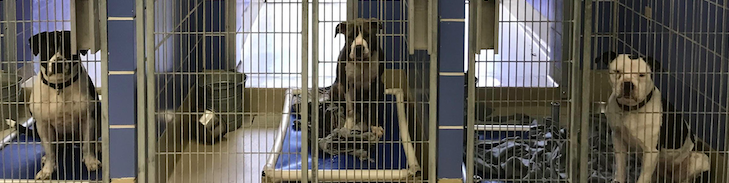

# Austin Animal Center Needs Analysis

**Author**: [Alison Peebles Madigan](mailto:alison.peeblesmadigan@flatironschool.com)

## Overview

This project analyzes the resource needs of the [Austin Animal Center](https://www.austintexas.gov/department/aac) (AAC), which shelters 16,000 animals annually with a [No Kill policy](https://www.austintexas.gov/blog/no-kill-austin). Descriptive analysis of animal intake and outcome data shows that some animals require extended stays and that the number of sheltered animals varies seasonally. The Austin Animal Center can use this analysis to adjust outreach, hiring, and space utilization to improve resource allocation.

## Business Understanding



The Austin Animal Shelter may be able to improve their resource allocation to both reduce costs and ensure that the center has staff and space to care for the animals brought to them. Doing so will allow the Austin Animal Shelter to better serve its clients while also freeing up resources to expand the scope of services they can offer.

## Data Understanding


### Data Preparation


## Exploratory Data Analysis


## Conclusions


### Next Steps


## Repository Structure

```
├── data
├── images
├── README.md
├── Animal_Shelter_Needs_Presentation.pdf
└── aircraft_selection_strategy.ipynb
```
